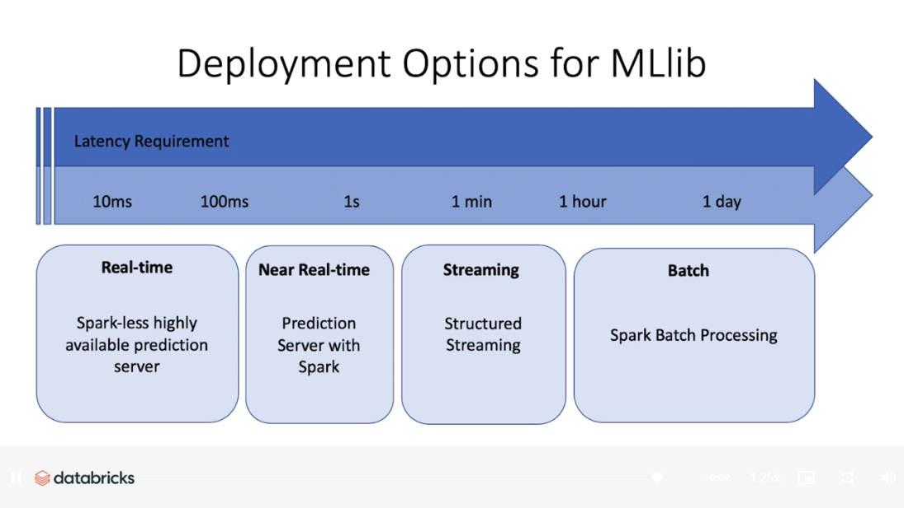

# MLOps

- [What is MLOps?](https://docs.microsoft.com/en-us/azure/machine-learning/concept-model-management-and-deployment)
- [MLOps on Azure](https://github.com/microsoft/MLOps)

# MLOps with AML or ADB

This repository compares an end-to-end ML pipeline in Azure Machine Learning and Azure Databricks.

We'll use a text data classification ML approach to show how the pipelines could be set up in both services. In the end we'll deploy an endpoint using the model that was trained in both services.

## Data

https://www.kaggle.com/ayushggarg/all-trumps-twitter-insults-20152021

## Deploy model

Depending on the use-case, the latency requirements might vary. Azure Databricks is capable of not only hosting, but also serving a model using MLFlow model serving. This means that a job cluster is spawned in the background to host the model. For dev/test workloads [MLFlow model serving](https://docs.microsoft.com/en-us/azure/databricks/applications/mlflow/model-serving#:~:text=%20MLflow%20Model%20Serving%20on%20Azure%20Databricks%20,model%20versions%20are%20deployed%2C%20and%20you...%20More%20) or ACI is the place to go. Deploying to AKS is recommended in production workflows, especially when high-performance/low-latency is required. AKS is the best choice in terms of latency, is more scalable, can be fine tuned and has better cost control. Find a comparison of the services [here](https://docs.microsoft.com/en-us/azure/machine-learning/how-to-deploy-and-where?tabs=python#choose-a-compute-target).

